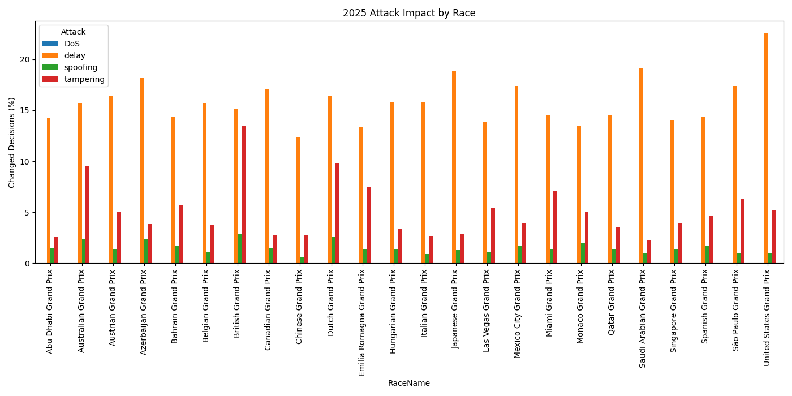
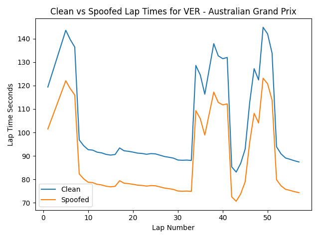
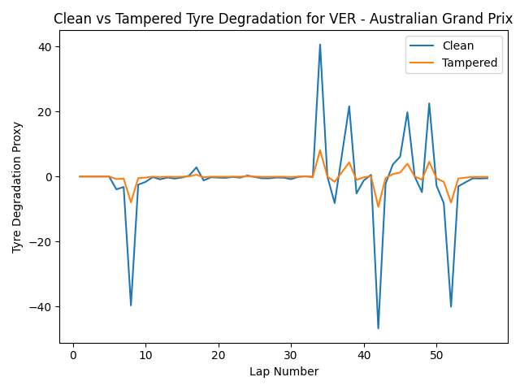
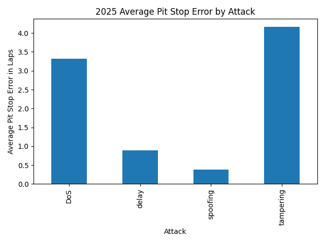
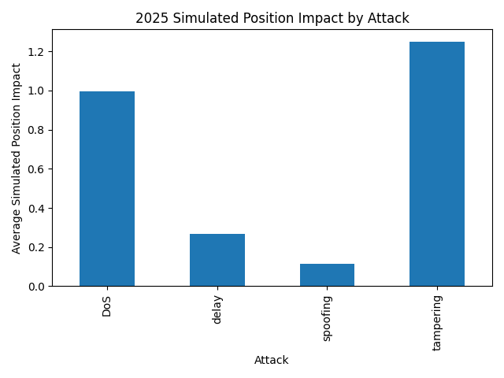
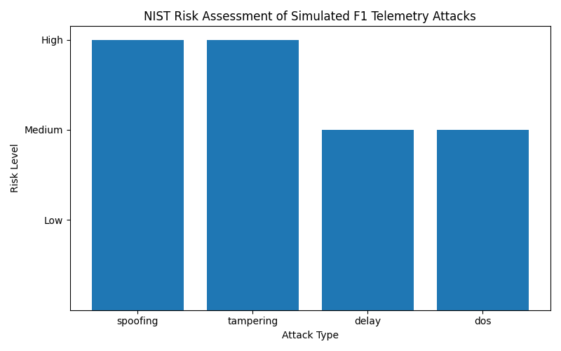

## 🔐 Cybersecurity Threat Model

Formula One teams rely heavily on telemetry for real-time analysis and race-strategy decisions. This project explores how the integrity and availability of telemetry data could affect those decisions if the data were manipulated, delayed or made unavailable.

Four controlled attack scenarios were simulated:

| Attack | Description | Primary Security Impact |
|---|---|---|
| Spoofing | Telemetry values are replaced with misleading data | Integrity |
| Tampering | Legitimate telemetry values are modified | Integrity |
| Delay | Telemetry data reaches the decision process late | Availability / Integrity |
| Denial of Service (DoS) | A proportion of telemetry data becomes unavailable | Availability |

The attacks are simulations performed against historical race data for defensive cybersecurity research. No live Formula One systems or infrastructure were targeted.

---

## 🛡️ Security Frameworks

The simulated attack scenarios were mapped against established cybersecurity concepts including:

- **CIA Triad** — Confidentiality, Integrity and Availability
- **STRIDE Threat Modelling** — including Spoofing, Tampering and Denial of Service
- **NIST-style Risk Assessment** — likelihood and impact scoring used to prioritise identified risks

The analysis identified telemetry **integrity** and **availability** as particularly important security properties because compromised data can influence downstream decision-making even when the underlying strategy software continues to operate normally.

---

## 📊 Attack Impact Across Races

The simulation was applied across multiple 2025 Formula One races to measure how frequently attack scenarios changed the resulting strategy decision.



The results demonstrate that different cyberattack types produce substantially different operational effects. Delayed telemetry produced the largest proportion of changed strategy decisions across the simulated races, while spoofing and tampering produced smaller but still measurable effects.

This highlights an important cybersecurity principle: **the severity of an attack cannot be determined solely by whether a system remains operational — the reliability and timeliness of the data must also be considered.**

---

## 🎭 Telemetry Spoofing

A spoofing scenario was used to demonstrate the effect of deliberately misleading telemetry values.



The comparison shows how manipulated telemetry can create a significantly different representation of vehicle performance while retaining the general structure of the original data.

From a cybersecurity perspective, this represents an **integrity attack**. A downstream system could continue processing the data successfully while making decisions based on inaccurate information.

This demonstrates why telemetry validation, authenticated data sources and anomaly detection are important controls in data-driven operational environments.

---

## 🔧 Telemetry Tampering

A second simulation modified telemetry associated with tyre degradation.



Tampering changes legitimate information after it has been generated or received. In a telemetry environment, this could cause analytics or strategy systems to interpret vehicle conditions incorrectly.

The scenario demonstrates how compromised **data integrity** can propagate into downstream decision-making without necessarily causing an obvious system failure.

---

## 🏁 Operational Impact

Cybersecurity risk becomes particularly important when compromised data affects operational decisions.

The simulation therefore measured the difference between the expected pit-stop recommendation and the recommendation produced under each attack scenario.



Tampering produced the largest average pit-stop error in the simulation, followed by denial-of-service conditions.

This demonstrates that the attack producing the greatest number of changed decisions is not necessarily the attack producing the greatest operational consequence.

### Simulated Position Impact

The project also estimated the resulting impact on race position.



Tampering produced the largest simulated position impact, demonstrating how compromised telemetry integrity could translate from a technical cybersecurity issue into an operational consequence.

---

## ⚠️ Risk Assessment

The attack scenarios were assessed using likelihood and impact scoring to provide a simple risk-prioritisation model.



The assessment classified:

| Threat | Risk Level |
|---|---|
| Spoofing | High |
| Tampering | High |
| Delay | Medium |
| Denial of Service | Medium |

The results suggest that attacks affecting **telemetry integrity** deserve particular attention because manipulated data may remain syntactically valid and continue flowing through analytical systems while influencing decisions.

---

## 🔎 Key Findings

The simulation produced several key cybersecurity observations:

1. **Telemetry integrity is critical.** A system can remain technically available while still producing unreliable decisions if its input data has been manipulated.

2. **Attack impact depends on the measurement used.** Delay generated the highest frequency of changed strategy decisions, while tampering produced the largest average pit-stop error and simulated position impact.

3. **Availability and integrity failures behave differently.** Delayed or unavailable telemetry affects access to timely information, while spoofing and tampering can cause systems to confidently process incorrect information.

4. **Operational impact should be included in cyber-risk analysis.** Technical indicators alone do not fully describe the potential consequence of compromised telemetry.

5. **Data validation is an important defensive control.** Authentication, integrity checking, anomaly detection and resilient telemetry pipelines could reduce the likelihood that manipulated or incomplete data influences downstream decisions.

---

## 🛠️ Technologies & Skills Demonstrated

- Python
- Pandas
- NumPy
- Matplotlib
- Formula One telemetry analysis
- Data processing and visualisation
- Cyberattack simulation
- Threat modelling
- STRIDE
- CIA Triad
- NIST-style risk assessment
- Cyber risk analysis
- Security control identification

---

## ⚙️ Installation

Clone the repository:

```bash
git clone https://github.com/NikitaKerai/IT-Cybersecurity-Portfolio.git
cd IT-Cybersecurity-Portfolio/F1-Telemetry-Cybersecurity-Risk-Analysis
```

Install the required Python packages:

```bash
pip install -r requirements.txt
```

---

## ▶️ Running the Project

Run the main simulation:

```bash
python src/main.py
```

Run the NIST risk-mapping analysis:

```bash
python src/nist_mapping.py
```

Run the OpenF1 validation:

```bash
python src/openf1_validation.py
```

---

## 📁 Project Structure

```text
F1-Telemetry-Cybersecurity-Risk-Analysis/
│
├── README.md
├── requirements.txt
├── .gitignore
│
├── src/
│   ├── main.py
│   ├── nist_mapping.py
│   └── openf1_validation.py
│
└── images/
    ├── graph_2_2025_attack_impact_by_race.png
    ├── graph_4_2025_clean_vs_spoofed_lap_times.png
    ├── graph_5_2025_clean_vs_tampered_tyre_degradation.png
    ├── graph_8_2025_average_pit_stop_error.png
    ├── graph_9_2025_position_impact.png
    └── nist_risk_graph_2025.png
```

---

## ⚖️ Scope & Ethics

This project is an educational cybersecurity simulation using historical Formula One data.

The attack scenarios represent controlled manipulation of locally processed telemetry data and are intended to demonstrate cybersecurity risk-analysis concepts. No live Formula One team systems, networks, vehicles or infrastructure were accessed, tested or attacked.

---

## 🎯 Project Objective

The objective of this project is to demonstrate the connection between **cybersecurity risk and operational decision-making**.

Rather than treating cybersecurity solely as a technical issue, the project demonstrates how compromised data integrity or availability can propagate through a data-driven system and potentially influence real-world decisions.
